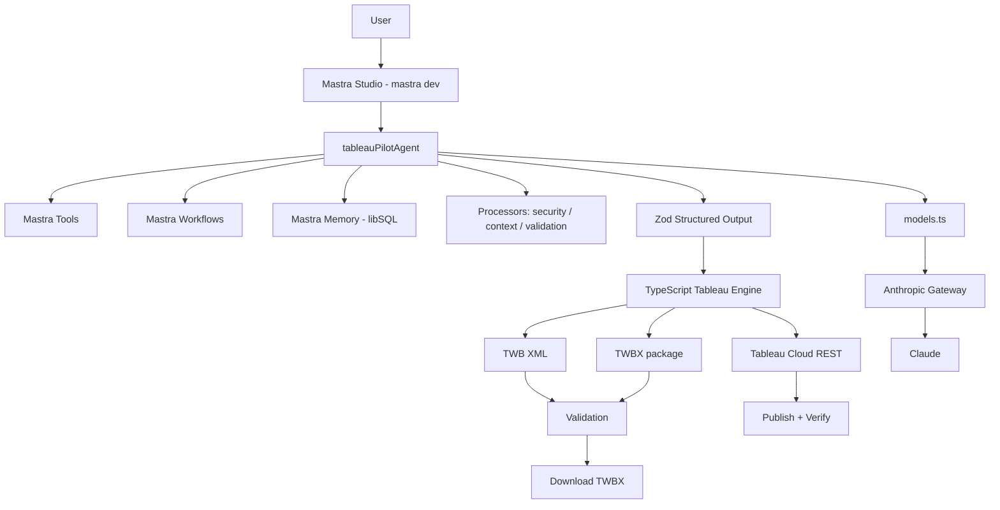
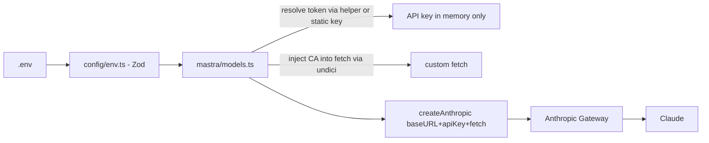
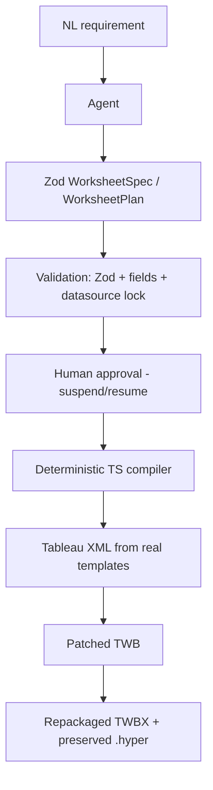
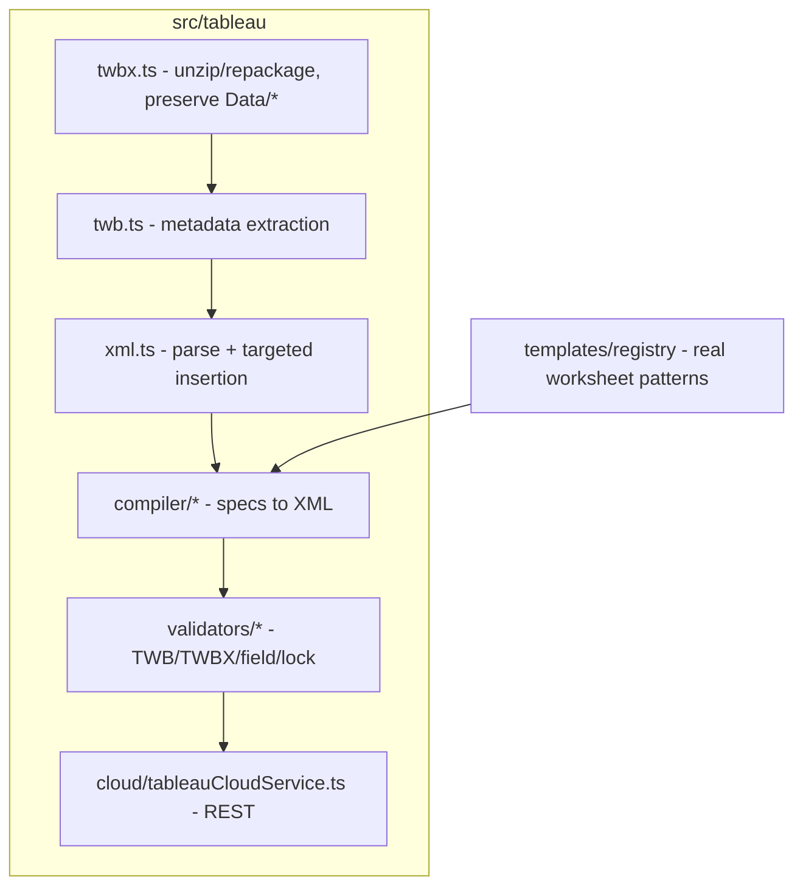
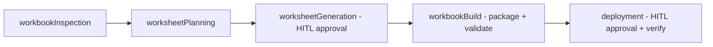

# TableauPilot AI - Architecture

## 1. High-level architecture

## 2. Model / auth flow (Anthropic Gateway)

- `ANTHROPIC_API_KEY_HELPER` is executed to obtain the token at runtime (cached
  in memory, never logged/persisted). Static `ANTHROPIC_API_KEY` is also supported.
- `ANTHROPIC_CA_CERT` (if present) is loaded into an `undici` dispatcher and the
  provider uses a wrapped `fetch`, so the corporate gateway TLS is trusted.
- On `401`, the cached token is cleared and re-resolved once (transparent refresh).
- Fallback: OpenRouter via `@ai-sdk/openai-compatible` when the Anthropic gateway
  config is absent or `LLM_PROVIDER=openrouter`.

## 3. Critical principle: LLM never writes XML

The agent only produces validated structured specs. A deterministic compiler
turns specs into XML using patterns extracted from the real sample workbook.

## 4. Component layers

| Layer | Path | Responsibility |
|-------|------|----------------|
| Config | `src/config/` | env parsing (Zod), safe logging/redaction |
| Model | `src/mastra/models.ts` | Anthropic gateway provider + CA + key helper + fallback |
| Schemas | `src/mastra/schemas/` | All Zod schemas (workbook/datasource/worksheet/deployment) |
| Agent | `src/mastra/agents/` | `tableauPilotAgent` with invariants + structured output |
| Tools | `src/mastra/tools/` | Deterministic operations, Zod I/O, approval on high-impact |
| Workflows | `src/mastra/workflows/` | Deterministic multi-step orchestration + HITL |
| Memory | `src/mastra/memory/` | libSQL-backed working/long-term memory |
| Processors | `src/mastra/processors/` | security / context / validation |
| Engine | `src/tableau/` | TWBX/TWB/XML, compiler, validators, cloud REST |
| Mastra root | `src/mastra/index.ts` | Registers everything for Studio + observability |

## 5. Tableau engine internals

- **Preservation**: `twbx.ts` copies the original into `workspace/original`, works in
  `workspace/working`, writes results to `workspace/output`. The locked datasource
  block and every file under `Data/` (incl. `.hyper`) are preserved unchanged.
- **Insertion, not rewrite**: `compiler` inserts a `<worksheet>` into `<worksheets>`
  and a matching `<window class='worksheet' name='...'>` into `<windows>` using
  targeted string operations to avoid reformatting/corrupting the source of truth.

## 6. Column-instance naming (deterministic rule)

Tableau references shelf pills as `[datasource].[<deriv>:<Field>:<typekey>]`:

- `<deriv>`: `none` (raw dimension), `sum`/`avg`/`cnt`/`min`/`max` (aggregation),
  `yr`/`qtr`/`mn`/`day` (date parts).
- `<typekey>`: `nk` (nominal), `ok` (ordinal), `qk` (quantitative).

Examples: `[none:Category:nk]`, `[sum:Sales:qk]`, `[yr:Order Date:ok]`.
The compiler derives these deterministically from `FieldSpec` + `ShelfSpec`.

## 7. Workflows overview

## 8. Storage & observability

- Single libSQL store (`file:./mastra.db`) backs Memory and workflow snapshots
  (required for suspend/resume across restarts).
- Mastra observability is enabled so Studio can inspect traces, tool calls,
  workflow steps, model calls, latency, and errors. Processors ensure secrets are
  never recorded.
